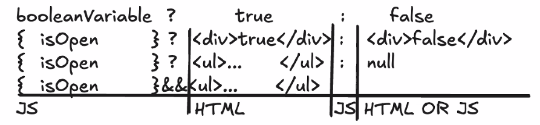

## Demos

## Project name: reactdemos

- simple environment
  - index.html
  - main.js
  - copy code and it runs
- JavaScript (not TypeScript)
- You cannot use import and export statement (JavaScript Modules)
- Does not have a build process (Webpack)
- How do you start it?

```sh
npm start #by default runs on port 5000
```

## Labs

## Project name: keeptrack

- use Create React App
- has a build process (use Webpack internally)
- TypeScript
- Does use import/export JavaScript Modules
- How do you start it?

```sh
npm start #by default runs 3000
```

